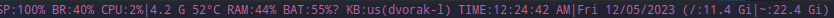

# archy-slstatus
## The status bar for archy-slstatus


### Installation
You can install archy-slstatus from the AUR with your favorite AUR helper.
```sh
yay -S archy-slstatus
```
Or you can install the latest version from the git repository.
```sh
yay -S archy-slstatus-git
```
Or you can build it yourself.
```sh
git clone https://github.com/archy-linux/archy-slstatus.git
cd archy-slstatus
sudo make install clean
```

### Mirrors
* [GitHub](https://github.com/archy-linux/archy-slstatus) - The upstream repository
* [GitLab](https://gitlab.com/archy-linux/archy-slstatus) - [](https://github.com/archy-linux/archy-slstatus/actions/workflows/gitlab-mirror.yml)
* [NotABug](https://notabug.org/archy-linux/archy-slstatus) - Not instant updates
* [Codeberg](https://codeberg.org/archy-linux/archy-slstatus) - [](https://github.com/archy-linux/archy-slstatus/actions/workflows/codeberg-mirror.yml)
* [Gitea](https://gitea.com/archy-linux/archy-slstatus) - [](https://github.com/archy-linux/archy-slstatus/actions/workflows/gitea-mirror.yml)
* [Gitdab](https://gitdab.com/archy-linux/archy-slstatus) - [](https://github.com/archy-linux/archy-slstatus/actions/workflows/gitdab-mirror.yml)
* [Pagure](https://pagure.io/archy-slstatus) - [](https://github.com/archy-linux/archy-slstatus/actions/workflows/pagure-mirror.yml)
* [Bitbucket](https://bitbucket.org/archy-linux/archy-slstatus) - [](https://github.com/archy-linux/archy-slstatus/actions/workflows/bitbucket-mirror.yml)
* [disroot](https://git.disroot.org/archy-linux/archy-slstatus) - [](https://github.com/archy-linux/archy-slstatus/actions/workflows/disroot-mirror.yml)
